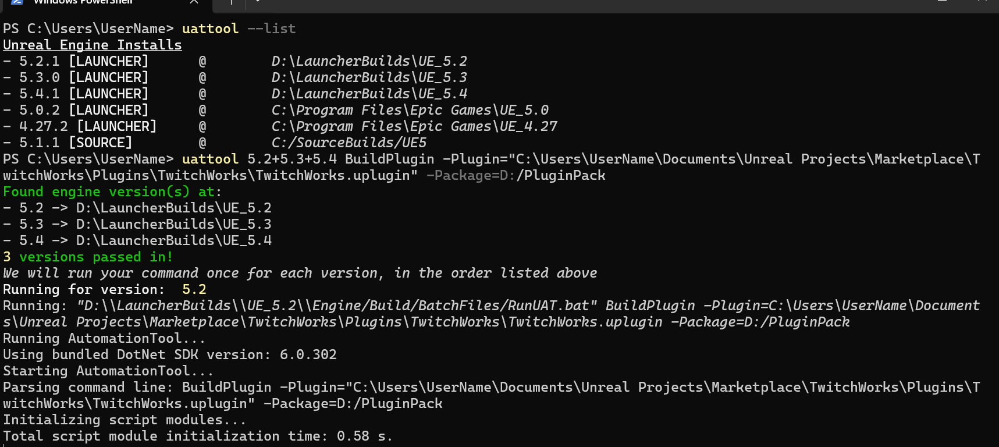

# UAT-Tool

   


UAT-Tool helps you access the Unreal Automation Tool more easily: copying paths is now a thing of the past!



UATTool will automatically detect launcher builds of the engine, and substitute the RunUAT.bat path into the command for you.


# How do I use it?
Once you have installed UATTool, start a new command prompt and run ```uattool```. This will show you the command's syntax. This can also be found in the snipet below:
```
Usage: ./uattool <engine_version> <UAT Command>
```

To list the engine versions that UATTool has detected on your system, run ```uattool --list```. This will list all of the available engines with their respective names and paths:
```
...
- 5.4.1 [LAUNCHER]      @        D:\LauncherBuilds\UE_5.4
- 5.1.1 [SOURCE]        @        C:/SourceBuilds/UE5
...
```

To run a UAT command, such as the `BuildPlugin` command, simply run uattool with the name of the version you'd like to use, and the rest of the UAT command you'd like to run. An example that we use internally can be found below:
```ps
uattool 5.2 BuildPlugin -Package="D:/PluginBuilds/TwitchWorks" -Plugin="D:\Unreal Projects\TwitchworksProject\Plugins\TwitchWorks\TwitchWorks.uplugin" 
```

With the new rust (`v1.0.0`) version, it is possible to batch commands for multiple engine versions, and to select source builds by their version/changelist number. For the `<engine_version>` listed above, separate your engine versions with a `+`. For any (source/launcher) build, specify the number (e.g. `5.4` or `5.4.1`). If you'd like a source build, prefix `source-` (e.g. `source-5.1`). To use a changelist number, use `cl-` (e.g. `cl-23058290`). Finally, to use the most recent version of Unreal Engine installed on the system (based on their 3-digit version number), use `latest`. 

Putting this all together, you may end up with something like the following. This will run your command once for each of the versions listed:
```ps
uattool source-5.2+5.2+cl-23058290+latest BuildPlugin ...
```

# How do I install it?
You can soon install `uattool` using the [Chocolatey package manager](https://community.chocolatey.org/)! Simply run the command below to install `uattool`:
```ps
choco install uattool
```

Alternatively, you can download the latest [release](https://github.com/How2Compute/UAT-Tool/releases), extract it, and add the directory that contains the `uattool.exe` file to your system's path yourself. We will unfortunately not be able to cover this within the scope of this README. 

# I think I've found a bug! What do I do?
Please consider opening up a GitHub Issue so we can investigate your issue. If possible, include the steps you took to hit the issue, the command you ran as well as a screenshot of the error.

# Compiling UAT-Tool
UATTool was built using rust. To build it, make sure you have `cargo` and `rust` installed. From there, simply run the following command to build UAT-Tool:
```sh
cargo build
```

# Disclaimer
THE SOFTWARE IS PROVIDED "AS IS", WITHOUT WARRANTY OF ANY KIND, EXPRESS OR IMPLIED, INCLUDING BUT NOT LIMITED TO THE WARRANTIES OF MERCHANTABILITY, FITNESS FOR A PARTICULAR PURPOSE, TITLE AND NON-INFRINGEMENT. IN NO EVENT SHALL THE COPYRIGHT HOLDERS OR ANYONE DISTRIBUTING THE SOFTWARE BE LIABLE FOR ANY DAMAGES OR OTHER LIABILITY, WHETHER IN CONTRACT, TORT OR OTHERWISE, ARISING FROM, OUT OF OR IN CONNECTION WITH THE SOFTWARE OR THE USE OR OTHER DEALINGS IN THE SOFTWARE.
